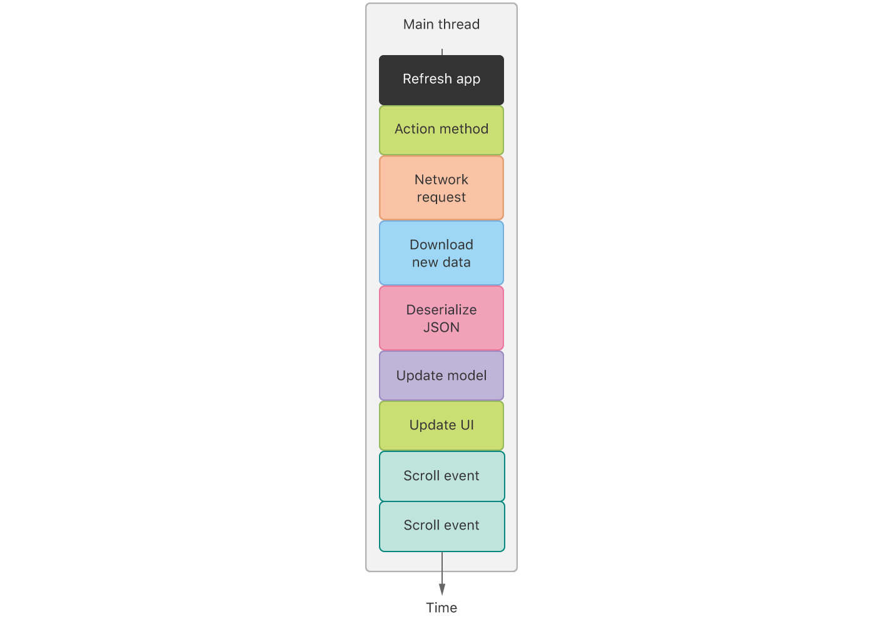
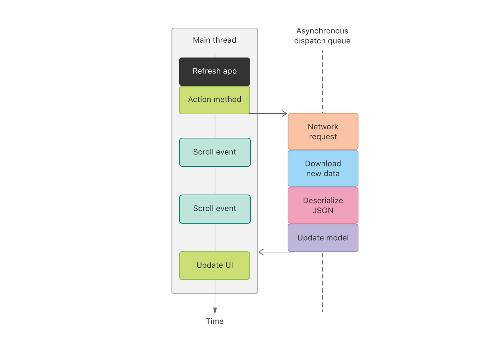

# 解决看门狗终止

[Addressing Watchdog Terminations](https://developer.apple.com/documentation/xcode/diagnosing_issues_using_crash_reports_and_device_logs/identifying_the_cause_of_common_crashes/addressing_watchdog_terminations)

确定由监视程序终止的无响应应用程序的签名，并解决该问题。

---

## 总览

用户期望应用程序能够快速启动，并对触摸和手势做出响应。操作系统使用监视程序来监视启动时间和应用程序响应，并终止无响应的应用程序。看门狗终止使用`0x8badf00d`崩溃报告的终止原因中的代码（发音为“吃不好的食物”）：

```
Exception Type:  EXC_CRASH (SIGKILL)
Exception Codes: 0x0000000000000000, 0x0000000000000000
Exception Note:  EXC_CORPSE_NOTIFY
Termination Reason: Namespace SPRINGBOARD, Code 0x8badf00d
```

看门狗将终止在很长一段时间内阻塞主线程的应用程序。有很多种方法可以长时间阻塞主线程，例如：

- 同步网络
- 处理大量数据，例如大型JSON文件或3D模型
- 同步触发大型[Core Data](https://developer.apple.com/documentation/coredata)存储的轻量级迁移
- [视觉](https://developer.apple.com/documentation/vision)分析要求

要了解为什么阻塞主线程是一个问题，请考虑最常见的示例，即从同步网络调用将数据加载到UI中。如果主线程忙于网络请求，则在完成网络调用之前，系统无法处理UI事件，例如多个滚动事件。如果网络通话花费很长时间，则从用户滚动到应用程序响应滚动事件之间要花费大量时间。这会使应用感到无响应。




### 解释应用程序响应性看门狗信息

当应用启动或响应事件缓慢时，崩溃报告中的终止信息将包含有关该应用如何度过的重要信息。例如，在启动后无法快速呈现UI的iOS应用在崩溃报告中具有以下内容：

```
Termination Description: SPRINGBOARD, 
    scene-create watchdog transgression: application<com.example.MyCoolApp>:667
    exhausted real (wall clock) time allowance of 19.97 seconds 
    | ProcessVisibility: Foreground 
    | ProcessState: Running 
    | WatchdogEvent: scene-create 
    | WatchdogVisibility: Foreground 
    | WatchdogCPUStatistics: ( 
    |  "Elapsed total CPU time (seconds): 15.290 (user 15.290, system 0.000), 28% CPU", 
    |  "Elapsed application CPU time (seconds): 0.367, 1% CPU" 
    | )
```

> **注意**
> 为了便于阅读，此示例包括额外的换行符。在此示例的原始崩溃报告文件中，看门狗信息较少。

当`scene-create`出现在中时`Termination Description`，该应用程序未在允许的挂钟时间内将其UI的第一帧呈现到屏幕上。如果`scene-update`出现在`Termination Description`而不是中`scene-create`，则该应用程序没有足够快地更新其UI，因为主线程太忙了。

> **注意**
> 崩溃报告中使用的`scene-create`和`scene-update`术语是指绘制到设备屏幕上的任何内容。此术语[`UIScene`](https://developer.apple.com/documentation/uikit/uiscene)与基于场景的[UIKit](https://developer.apple.com/documentation/uikit)应用程序无关。

该`Elapsed total CPU time`显示CPU多少时间跑了挂钟的时间内系统上的所有进程。此CPU时间以及应用程序CPU时间是跨CPU内核的总CPU利用率，可能超过100％。例如，如果一个CPU内核的利用率为100％，第二个CPU内核的利用率为20％，则CPU的总使用率是120％。

会`Elapsed application CPU time`显示应用程序在墙上时钟时间内花了多少时间在CPU上运行。如果这个数字过高或过低，则说明存在问题。如果此数字很高，则该应用程序将在其所有线程上执行大量工作-该数字汇总了所有线程，而不是特定于主线程。如果此数字较低，则该应用程序通常处于空闲状态，因为它正在等待系统资源（例如网络连接）。

### 解释后台任务看门狗信息（watchOS）

除了应用程序的响应性看门狗之外，watchOS还具有用于后台任务的看门狗。在此示例中，一个应用没有在允许的时间内完成[Watch Watch](https://developer.apple.com/documentation/watchconnectivity)后台任务的处理：

```
Termination Reason: CAROUSEL, WatchConnectivity watchdog transgression. 
    Exhausted wall time allowance of 15.00 seconds.
Termination Description: SPRINGBOARD, 
    CSLHandleBackgroundWCSessionAction watchdog transgression: xpcservice<com.example.MyCoolApp.watchkitapp.watchextension>:220:220 
    exhausted real (wall clock) time allowance of 15.00 seconds 
    | <FBExtensionProcess: 0x16df02a0; xpcservice<com.example.MyCoolApp.watchkitapp.watchextension>:220:220; typeID: com.apple.watchkit> 
      Elapsed total CPU time (seconds): 24.040 (user 24.040, system 0.000), 81% CPU 
    | Elapsed application CPU time (seconds): 1.223, 6% CPU, lastUpdate 2020-01-20 11:56:01 +0000
```

> **注意**
> 为了便于阅读，此示例包括额外的换行符。在此示例的原始崩溃报告文件中，看门狗信息较少。

如[解释App响应性看门狗信息中](https://developer.apple.com/documentation/xcode/diagnosing_issues_using_crash_reports_and_device_logs/identifying_the_cause_of_common_crashes/addressing_watchdog_terminations#3561602)所述，了解有关挂钟时间和CPU时间的[信息](https://developer.apple.com/documentation/xcode/diagnosing_issues_using_crash_reports_and_device_logs/identifying_the_cause_of_common_crashes/addressing_watchdog_terminations#3561602)。

### 确定看门狗触发的原因

回溯有时有助于确定在应用程序主线程上花费了很多时间的时间。例如，如果某个应用程序在主线程上使用同步网络，则网络功能在主线程的回溯中可见。

```
Thread 0 name:  Dispatch queue: com.apple.main-thread
Thread 0 Crashed:
0   libsystem_kernel.dylib            0x00000001c22f8670 semaphore_wait_trap + 8
1   libdispatch.dylib                 0x00000001c2195890 _dispatch_sema4_wait$VARIANT$mp + 24
2   libdispatch.dylib                 0x00000001c2195ed4 _dispatch_semaphore_wait_slow + 140
3   CFNetwork                         0x00000001c57d9d34 CFURLConnectionSendSynchronousRequest + 388
4   CFNetwork                         0x00000001c5753988 +[NSURLConnection sendSynchronousRequest:returningResponse:error:] + 116  + 14728
5   Foundation                        0x00000001c287821c -[NSString initWithContentsOfURL:usedEncoding:error:] + 256
6   libswiftFoundation.dylib          0x00000001f7127284 NSString.__allocating_init+ 680580 (contentsOf:usedEncoding:) + 104
7   libswiftFoundation.dylib          0x00000001f712738c String.init+ 680844 (contentsOf:) + 96
8   MyCoolApp                         0x00000001009d31e0 ViewController.loadData() (in MyCoolApp) (ViewController.swift:21)
```

但是，主线程的回溯并不总是包含问题的根源。例如，假设您的应用完全需要4秒才能完成任务，而总允许的挂钟时间为5秒。当看门狗在5秒钟后终止应用程序时，花了4秒钟的代码将不会在回溯中显示，因为它已经完成了，但它几乎消耗了整个时间预算。崩溃报告会记录看门狗终止应用程序时应用程序正在执行的回溯帧，即使所记录的回溯帧不是问题的根源。

您也许可以使用崩溃报告中所有回溯中的信息来帮助确定您在应用程序启动过程中的位置。通过根据这些信息进行反向工作，您可以确定已经运行了哪些代码以将调查范围缩小到该代码。

此外，在开发过程中分析应用程序的性能，以在发布应用程序之前消除问题，并在发布应用程序后监视应用程序的性能。[减少应用程序的启动时间](https://developer.apple.com/documentation/xcode/improving_your_app_s_performance/reducing_your_app_s_launch_time)并[提高应用程序的响应能力可](https://developer.apple.com/documentation/xcode/improving_your_app_s_performance/improving_app_responsiveness)提供有关这些技术的更多信息。

### 识别隐藏的同步网络代码

阻塞主线程并导致看门狗终止的同步网络有时隐藏在掩盖危险的抽象层后面。在这个例子回溯[查明原因看门狗触发](https://developer.apple.com/documentation/xcode/diagnosing_issues_using_crash_reports_and_device_logs/identifying_the_cause_of_common_crashes/addressing_watchdog_terminations#3561607)显示应用程序通过调用触发同步下载一个URL，在框架7.本API隐含使得从初始化返回前一个同步的网络请求。即使此初始化程序很快完成并且不在崩溃报告中，它仍然可以导致监视程序终止。其他带有带URL参数的初始化符的类（例如和）的行为也相同。[`init(contentsOf:)`](https://developer.apple.com/documentation/swift/string/3126735-init)`https`[`XMLParser`](https://developer.apple.com/documentation/foundation/xmlparser)[`NSData`](https://developer.apple.com/documentation/foundation/nsdata)

隐藏同步网络的其他常见示例包括：

- 默认情况下，可达性API [SCNetworkReachability](https://developer.apple.com/documentation/systemconfiguration/scnetworkreachability-g7d)同步运行。看似无害的功能可能触发看门狗终止。[`SCNetworkReachabilityGetFlags(_:_:)`](https://developer.apple.com/documentation/systemconfiguration/1514924-scnetworkreachabilitygetflags)
- 由BSD提供的DNS功能（例如`gethostbyname(_:)`和）永远不会在主线程上安全调用。和之类的功能仅在仅使用IP地址而不使用DNS名称（即分别指定和）时才安全。`gethostbyaddr(_:_:_:)``getnameinfo(_:_:_:_:_:_:_:)``getaddrinfo(_:_:_:_:)``AI_NUMERICHOST``NI_NUMERICHOST`

同步网络问题在很大程度上取决于网络环境。如果您始终在网络连接良好的办公室中测试应用程序，则永远不会遇到此类问题。但是，一旦开始将应用程序部署到用户（他们在各种网络环境中运行应用程序），同步网络问题就变得很普遍。在Xcode中，您可以模拟不利的网络状况，以帮助在用户遇到的情况下测试您的应用程序。请参阅[在不利的设备条件下测试（iOS）](https://help.apple.com/xcode/mac/current/#/dev308429d42)。

### 将代码移出主线程

将所有对应用程序UI不必要的长时间运行的代码移至后台队列。通过将工作移至后台队列，应用程序的主线程可以更快地完成应用程序的启动并更快地处理事件。使用网络示例，而不是在主线程上执行同步网络调用，将其移至异步后台队列。通过将这项工作移至后台队列，主线程可以在滚动事件发生时对其进行处理，从而使应用程序具有更高的响应速度。





如果长时间运行的代码来自系统框架之一，请确定该框架是否提供了将工作移离主线程的替代方法。例如，考虑使用代替的在[RealityKit中](https://developer.apple.com/documentation/realitykit)加载复杂的3D模型，这是同步的。作为另一个示例，[Vision](https://developer.apple.com/documentation/vision)提供了 ，这暗示系统应将分析请求的处理移出主线程。[`loadAsync(contentsOf:withName:)`](https://developer.apple.com/documentation/realitykit/entity/3244088-loadasync)[`Apple的文档很清楚地说明了initialize和load的区别在于：load是只要类所在文件被引用就会被调用，而initialize是在类或者其子类的第一个方法被调用前调用。所以如果类没有被引用进项目，就不会有load调用；但即使类文件被引用进来，但是没有使用，那么initialize也不会被调用。  它们的相同点在于：方法只会被调用一次。（其实这是相对runtime来说的，后边会做进一步解释）。  文档也明确阐述了方法调用的顺序：父类(Superclass)的方法优先于子类(Subclass)的方法，类中的方法优先于类别(Category)中的方法。(contentsOf:withName:)`](https://developer.apple.com/documentation/realitykit/entity/3244082-load)[`preferBackgroundProcessing`](https://developer.apple.com/documentation/vision/vnrequest/2875404-preferbackgroundprocessing)

如果网络代码有助于终止看门狗，请考虑以下常见解决方案：

- 使用异步运行网络代码[`URLSession`](https://developer.apple.com/documentation/foundation/urlsession)。这是最好的解决方案。异步网络代码具有许多优点，包括安全访问网络而不必担心线程。
- 代替使用[SCNetworkReachability](https://developer.apple.com/documentation/systemconfiguration/scnetworkreachability-g7d)，用于在网络路径更改时接收更新。系统在您调用时传递的队列上传递更新，因此路径更新可以在主线程之外安全地起作用。[`NWPathMonitor`](https://developer.apple.com/documentation/network/nwpathmonitor)[`start(queue:)`](https://developer.apple.com/documentation/network/nwpathmonitor/2998737-start)
- 在辅助线程上执行同步网络。如果异步运行网络代码非常困难，例如使用假定同步网络的大型可移植代码库时，请通过在辅助线程上运行同步网络代码来避免看门狗。
- 在大多数情况下，建议不要手动解析DNS。用于[`URLSession`](https://developer.apple.com/documentation/foundation/urlsession)使系统代表您处理DNS解析。如果切换非常困难，并且您仍然需要手动使用DNS地址，请使用`CFHost`或的异步API 。`<dns_sd.h>`