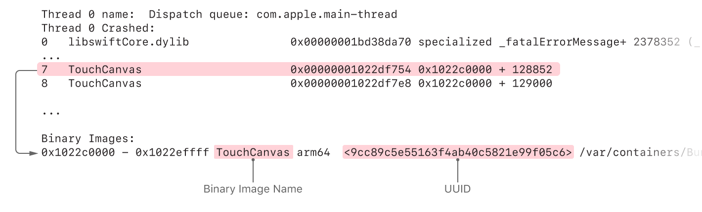
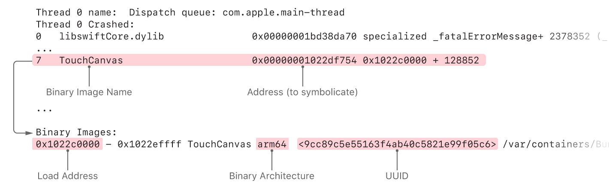

# 向崩溃报告中添加可识别的符号名称

[Adding Identifiable Symbol Names to a Crash Report](https://developer.apple.com/documentation/xcode/diagnosing_issues_using_crash_reports_and_device_logs/adding_identifiable_symbol_names_to_a_crash_report)

将崩溃报告中的十六进制地址替换为与应用程序代码相对应的函数名称和行号。

---

## 总览

当应用崩溃时，操作系统会收集有关崩溃时应用正在执行的诊断信息。崩溃报告中最重要的部分之一是线程回溯，报告为十六进制地址。您可以将这些线程回溯转换为源代码中可读的函数名和行号（称为*symbolication*的过程），然后使用该信息来了解您的应用崩溃的原因。在许多情况下，Xcode中的崩溃管理器会[自动](https://help.apple.com/xcode/mac/current/#/dev709125d2e)为您[显示崩溃报告](https://help.apple.com/xcode/mac/current/#/dev709125d2e)。

### 确定故障报告是否为符号

要使用崩溃报告诊断应用程序问题，您需要一个完全符号化或部分符号化的崩溃报告。非符号化的崩溃报告很少有用。

完全符号化的崩溃报告在回溯的每一帧上都有函数名称，而不是十六进制的内存地址。每个框架代表一个当前在特定线程上运行的函数调用，并提供应用程序功能以及应用程序崩溃时正在执行的操作系统框架的视图。完全符号化的崩溃报告为您提供了有关崩溃的最深刻见解。具有完全符号化的崩溃报告后，请查阅[分析崩溃报告](https://developer.apple.com/documentation/xcode/diagnosing_issues_using_crash_reports_and_device_logs/analyzing_a_crash_report)以获取有关确定崩溃源的详细信息。

完全符号化的崩溃报告的示例：

```
Thread 0 name:  Dispatch queue: com.apple.main-thread
Thread 0 Crashed:
0   libswiftCore.dylib                0x00000001bd38da70 specialized _fatalErrorMessage+ 2378352 (_:_:file:line:flags:) + 384
1   libswiftCore.dylib                0x00000001bd38da70 specialized _fatalErrorMessage+ 2378352 (_:_:file:line:flags:) + 384
2   libswiftCore.dylib                0x00000001bd15958c _ArrayBuffer._checkInoutAndNativeTypeCheckedBounds+ 66956 (_:wasNativeTypeChecked:) + 200
3   libswiftCore.dylib                0x00000001bd15c814 Array.subscript.getter + 88
4   TouchCanvas                       0x00000001022cbfa8 Line.updateRectForExistingPoint(_:) (in TouchCanvas) + 656
5   TouchCanvas                       0x00000001022c90b0 Line.updateWithTouch(_:) (in TouchCanvas) + 464
6   TouchCanvas                       0x00000001022e7374 CanvasView.updateEstimatedPropertiesForTouches(_:) (in TouchCanvas) + 708
7   TouchCanvas                       0x00000001022df754 ViewController.touchesEstimatedPropertiesUpdated(_:) (in TouchCanvas) + 304
8   TouchCanvas                       0x00000001022df7e8 @objc ViewController.touchesEstimatedPropertiesUpdated(_:) (in TouchCanvas) + 120
9   UIKitCore                         0x00000001b3da6230 forwardMethod1 + 136
10  UIKitCore                         0x00000001b3da6230 forwardMethod1 + 136
11  UIKitCore                         0x00000001b3e01e24 -[_UIEstimatedTouchRecord dispatchUpdateWithPressure:stillEstimated:] + 340
```

部分符号化的崩溃报告具有某些回溯帧的功能名称，以及其他回溯帧的十六进制地址。部分象征性的崩溃报告可能包含足够的信息来理解崩溃，这取决于崩溃的类型以及回溯中哪些帧被象征了。但是，您仍然应该[在Xcode中](https://developer.apple.com/documentation/xcode/diagnosing_issues_using_crash_reports_and_device_logs/adding_identifiable_symbol_names_to_a_crash_report#3403794)对[崩溃报告](https://developer.apple.com/documentation/xcode/diagnosing_issues_using_crash_reports_and_device_logs/adding_identifiable_symbol_names_to_a_crash_report#3403794)进行符号化，以使该报告完全符号化，这将使您对崩溃有一个完整的了解。

部分符号化的崩溃报告的示例：

```
Thread 0 name:  Dispatch queue: com.apple.main-thread
Thread 0 Crashed:
0   libswiftCore.dylib                0x00000001bd38da70 specialized _fatalErrorMessage+ 2378352 (_:_:file:line:flags:) + 384
1   libswiftCore.dylib                0x00000001bd38da70 specialized _fatalErrorMessage+ 2378352 (_:_:file:line:flags:) + 384
2   libswiftCore.dylib                0x00000001bd15958c _ArrayBuffer._checkInoutAndNativeTypeCheckedBounds+ 66956 (_:wasNativeTypeChecked:) + 200
3   libswiftCore.dylib                0x00000001bd15c814 Array.subscript.getter + 88
4   TouchCanvas                       0x00000001022cbfa8 0x1022c0000 + 49064
5   TouchCanvas                       0x00000001022c90b0 0x1022c0000 + 37040
6   TouchCanvas                       0x00000001022e7374 0x1022c0000 + 160628
7   TouchCanvas                       0x00000001022df754 0x1022c0000 + 128852
8   TouchCanvas                       0x00000001022df7e8 0x1022c0000 + 129000
9   UIKitCore                         0x00000001b3da6230 forwardMethod1 + 136
10  UIKitCore                         0x00000001b3da6230 forwardMethod1 + 136
11  UIKitCore                         0x00000001b3e01e24 -[_UIEstimatedTouchRecord dispatchUpdateWithPressure:stillEstimated:] + 340
```

未符号化的崩溃报告在已加载的二进制映像中包含可执行代码的十六进制地址。这些报告在回溯中不包含任何函数名称。由于无[符号的崩溃报告](https://developer.apple.com/documentation/xcode/diagnosing_issues_using_crash_reports_and_device_logs/adding_identifiable_symbol_names_to_a_crash_report#3403794)很少有用，[因此请在Xcode](https://developer.apple.com/documentation/xcode/diagnosing_issues_using_crash_reports_and_device_logs/adding_identifiable_symbol_names_to_a_crash_report#3403794)中用[符号表示崩溃报告](https://developer.apple.com/documentation/xcode/diagnosing_issues_using_crash_reports_and_device_logs/adding_identifiable_symbol_names_to_a_crash_report#3403794)。

未符号表示的崩溃报告的示例：

```
Thread 0 name:  Dispatch queue: com.apple.main-thread
Thread 0 Crashed:
0   libswiftCore.dylib                0x00000001bd38da70 0x1bd149000 + 2378352
1   libswiftCore.dylib                0x00000001bd38da70 0x1bd149000 + 2378352
2   libswiftCore.dylib                0x00000001bd15958c 0x1bd149000 + 66956
3   libswiftCore.dylib                0x00000001bd15c814 0x1bd149000 + 79892
4   TouchCanvas                       0x00000001022cbfa8 0x1022c0000 + 49064
5   TouchCanvas                       0x00000001022c90b0 0x1022c0000 + 37040
6   TouchCanvas                       0x00000001022e7374 0x1022c0000 + 160628
7   TouchCanvas                       0x00000001022df754 0x1022c0000 + 128852
8   TouchCanvas                       0x00000001022df7e8 0x1022c0000 + 129000
9   UIKitCore                         0x00000001b3da6230 0x1b3348000 + 10871344
10  UIKitCore                         0x00000001b3da6230 0x1b3348000 + 10871344
11  UIKitCore                         0x00000001b3e01e24 0x1b3348000 + 11247140
```


### 在Xcode中象征崩溃报告

Xcode是符号化崩溃报告的首选方法，因为它会立即使用Mac上的所有可用文件。对于特殊的调试情况，例如当您在Xcode调试器中具有未符号化的堆栈跟踪而没有完整的崩溃报告时，可以[使用命令](https://developer.apple.com/documentation/xcode/diagnosing_issues_using_crash_reports_and_device_logs/adding_identifiable_symbol_names_to_a_crash_report#3403800)行将崩溃报告[符号化，](https://developer.apple.com/documentation/xcode/diagnosing_issues_using_crash_reports_and_device_logs/adding_identifiable_symbol_names_to_a_crash_report#3403800)以符号化每个帧。`dSYM`

要用Xcode表示符号，请在“[设备和模拟器”窗口中](https://help.apple.com/xcode/mac/current/#/dev85c64ec79)单击“设备日志”按钮，然后将崩溃报告文件拖放到设备日志列表中。

> **重要**
> 崩溃报告必须具有`.crash`文件扩展名。如果当机报告没有文件扩展名或具有类似的其他文件扩展名`.txt`，请`.crash`在使用符号扩展名之前将其重命名。

如果崩溃报告没有符号化或仅部分符号化，则Xcode找不到匹配的符号信息，您将需要通过以下方式获取符号信息：

- 如果未符号化操作系统的框架，则需要与故障报告中记录的操作系统版本相匹配的设备符号信息。要解决此问题，请参阅[获取设备符号信息](https://developer.apple.com/documentation/xcode/diagnosing_issues_using_crash_reports_and_device_logs/adding_identifiable_symbol_names_to_a_crash_report#3403795)。
- 如果未使用符号表示应用程序，应用程序扩展或框架的框架，则需要从App Store获取文件，或使用Spotlight查找现有文件。要解决此问题，请参阅[从App Store获取更新的应用程序符号信息，](https://developer.apple.com/documentation/xcode/diagnosing_issues_using_crash_reports_and_device_logs/adding_identifiable_symbol_names_to_a_crash_report#3403799)并[使用Spotlight找到dSYM](https://developer.apple.com/documentation/xcode/diagnosing_issues_using_crash_reports_and_device_logs/adding_identifiable_symbol_names_to_a_crash_report#3403787)。如果您的应用程序使用第三方构建的框架，则可能需要向框架供应商索要该文件。`dSYM``dSYM``dSYM`

有了完全符号化的崩溃报告后，请查阅[分析崩溃报告](https://developer.apple.com/documentation/xcode/diagnosing_issues_using_crash_reports_and_device_logs/analyzing_a_crash_report)以确定[崩溃](https://developer.apple.com/documentation/xcode/diagnosing_issues_using_crash_reports_and_device_logs/analyzing_a_crash_report)的来源。

### 获取设备符号信息

为了使崩溃报告中的操作系统框架中的符号可识别，您需要从设备中收集系统框架的符号。对于iOS，iPadOS，watchOS和tvOS应用程序，Xcode会自动从您连接到Mac的每个设备中复制操作系统符号。对于macOS和Mac Catalyst应用程序，通过在与崩溃报告中指定的macOS版本匹配的macOS版本上使用Xcode来表示崩溃日志。

系统框架的符号特定于操作系统版本和设备的CPU体系结构。例如，运行iOS 13.1.0的iPhone的符号与运行iOS 13.1.2的同一iPhone的符号不同。如果您的应用程序在支持多种CPU架构的操作系统版本（例如`arm64`和）上运行`arm64e`，则具有该`arm64`架构的设备将仅包含`arm64`该操作系统框架版本的符号；它在`arm64e`设备上没有操作系统框架的符号。

### 从App Store获取更新的App符号信息

位代码是已编译代码的中间表示。当您将带有位码的版本提交给App Store时，App Store会将位码编译为机器码。App Store将来可能会再次编译该应用程序，以利用更新的编译器改进而无需您采取任何措施。

> **注意**
> 位代码不适用于macOS和Mac Catalyst应用。

如果您在启用了位码的情况下通过App Store分发应用程序，则Mac将不包含与最终版本匹配的文件，因为从位码对应用程序进行的最终编译会在App Store中进行。由App Store创建的最终版本与原始Xcode存档中的版本具有不同的版本UUID和不同的文件。[使用Xcode Organizer为](https://help.apple.com/xcode/mac/current/#/devef5928039)App Store创建的版本[下载dSYM文件](https://help.apple.com/xcode/mac/current/#/devef5928039)。`dSYM``dSYM`

> **重要**
> 您必须下载这些文件，以表示从App Review或从其设备向您发送崩溃报告的客户收到的崩溃报告。`dSYM`

### 使用Spotlight找到dSYM

要确定您的Mac上是否存在需要用符号表示一个二进制文件的十六进制地址的文件：`dSYM`

1. 在回溯中找到没有符号的框架。在第二列中注意二进制映像的名称。

2. 在崩溃报告底部的二进制图像列表中查找具有该名称的二进制图像。该列表包含崩溃时加载到进程中的每个二进制映像的构建UUID。使用`grep`命令行工具在二进制图像列表中找到条目：

   ```
   % grep --after-context=1000 "Binary Images:" <Path to Crash Report> | grep <Binary Name>
   ```

从二进制映像部分获得构建UUID之后：

1. 将二进制映像的构建UUID转换为32个字符的字符串，该字符串分为8-4-4-4-12（`XXXXXXXX-XXXX-XXXX-XXXX-XXXXXXXXXXXX`）组。所有字母必须为大写。

2. 使用`mdfind`命令行工具查询（包括引号）搜索构建UUID ：

   ```
   % mdfind "com_apple_xcode_dsym_uuids == <UUID>"
   ```

如果Spotlight找到用于构建UUID的文件，则打印该文件的路径。`dSYM``mdfind``dSYM`





使用此示例中的信息，查找的命令为：`dSYM`

```
% grep --after-context=1000 "Binary Images:" <Path to Crash Report> | grep TouchCanvas
0x1022c0000 - 0x1022effff TouchCanvas arm64  <9cc89c5e55163f4ab40c5821e99f05c6>

% mdfind "com_apple_xcode_dsym_uuids == 9CC89C5E-5516-3F4A-B40C-5821E99F05C6"
```

找到文件后，[匹配“ Build UUID”](https://developer.apple.com/documentation/xcode/diagnosing_issues_using_crash_reports_and_device_logs/adding_identifiable_symbol_names_to_a_crash_report#3403797)以确认其构建UUID与二进制映像的“ Build UUID”相匹配。一旦你确认生成的UUID的比赛，无论是[Symbolicate在Xcode的崩溃报告](https://developer.apple.com/documentation/xcode/diagnosing_issues_using_crash_reports_and_device_logs/adding_identifiable_symbol_names_to_a_crash_report#3403794)或[Symbolicate使用命令行的崩溃报告](https://developer.apple.com/documentation/xcode/diagnosing_issues_using_crash_reports_and_device_logs/adding_identifiable_symbol_names_to_a_crash_report#3403800)。`dSYM`

如果Spotlight找不到匹配项，则不会打印任何内容，您需要：`dSYM``mdfind`

- 如果您的应用是在启用了位码的情况下构建的，请从App Store下载文件。请参阅[从App Store获取更新的应用程序符号信息](https://developer.apple.com/documentation/xcode/diagnosing_issues_using_crash_reports_and_device_logs/adding_identifiable_symbol_names_to_a_crash_report#3403799)。`dSYM`
- 确认您仍然拥有崩溃的应用程序版本的Xcode存档。如果您不再拥有此存档，则无法使用该版本的应用程序象征应用程序的堆栈框架。为避免将来发生这种情况，请发布应用程序的新版本，并保留该版本的Xcode存档。然后，您将可以象征新应用程序崩溃报告。
- 确保Xcode归档文件位于Spotlight可以找到它的位置，例如macOS主目录。
- 验证您的构建产生调试信息。请参阅[构建您的应用程序以包含调试信息](https://developer.apple.com/documentation/xcode/building_your_app_to_include_debugging_information)。

### 匹配构建UUID

如果您认为二进制文件或二进制文件可用于表示崩溃报告，请使用以下命令验证构建UUID是否匹配。如果构建UUID彼此不匹配，或者与崩溃报告的“二进制映像”部分中列出的构建UUID不匹配，则不能使用文件来象征该崩溃报告。`dSYM``dwarfdump`

```
% dwarfdump --uuid <PathToDSYMFile>/Contents/Resources/DWARF/<BinaryName>
% dwarfdump --uuid <PathToBinary>
```


### 恢复隐藏的符号

对于使用位码提交到App Store的应用程序构建，Xcode会将应用程序文件中的符号替换为混淆的符号，例如“[构建包含调试信息的应用程序”](https://developer.apple.com/documentation/xcode/building_your_app_to_include_debugging_information)说明了这种类型的符号。在符号化崩溃报告之前，请使用源代码中的符号替换从App Store Connect下载的文件中的这些隐藏符号。当您在Xcode中下载时，Xcode会自动执行此替换。但是，如果您使用App Store Connect网站下载文件，则需要在每个下载的文件上使用以下命令来进行符号替换：`dSYM``_hidden#109_. ``dSYM``dSYMs``dSYM``dSYM`

```
% dsymutil -symbol-map <PathToXcodeArchive>/MyGreatApp.xcarchive/BCSymbolMaps <PathToDownloadedDSYMs>/<UUID>.dSYM
```

> **注意**
> 位代码不适用于macOS和Mac Catalyst应用。

### 使用命令行符号化崩溃报告

对于特殊的调试情况，例如符号化LLDB命令行提供的回溯部分，您可以使用`atos`命令符号化崩溃报告。`atos`如果符号信息可用，该命令会将十六进制地址从源代码转换为可识别的函数名称和行号。象征使用`atos`：

1. 在回溯中找到要符号化的框架。在第二列中注意二进制映像的名称，在第三列中注意地址。
2. 在崩溃报告底部的二进制图像列表中查找具有该名称的二进制图像。注意二进制映像的体系结构和加载地址。
3. 找到二进制文件。如果您不知道文件位于何处，请参阅[使用Spotlight查找dSYM](https://developer.apple.com/documentation/xcode/diagnosing_issues_using_crash_reports_and_device_logs/adding_identifiable_symbol_names_to_a_crash_report#3403787)以查找与二进制映像的构建UUID相匹配的文件。`dSYM``dSYM``dSYM`
4. 使用`atos`公式将回溯中的地址符号化，替换您在先前步骤中收集的信息：

```
% atos -arch <BinaryArchitecture> -o <PathToDSYMFile>/Contents/Resources/DWARF/<BinaryName>  -l <LoadAddress> <AddressesToSymbolicate>
```

> **注意
> `dSYM`文件是macOS捆绑软件，其中包含带有调试符号的文件。调用时`atos`，必须在捆绑包中提供此文件的路径，而不仅仅是外部捆绑包。`dSYM`

例如，查看此崩溃报告中突出显示的部分：





使用此示例中的信息，complete`atos`命令及其输出为：

```
% atos -arch arm64 -o TouchCanvas.app.dSYM/Contents/Resources/DWARF/TouchCanvas -l 0x1022c0000 0x00000001022df754
ViewController.touchesEstimatedPropertiesUpdated(_:) (in TouchCanvas) + 304
```

使用至少拥有部分符号化的崩溃报告后`atos`，请参阅[分析崩溃报告](https://developer.apple.com/documentation/xcode/diagnosing_issues_using_crash_reports_and_device_logs/analyzing_a_crash_report)以获取信息以确定崩溃的来源。