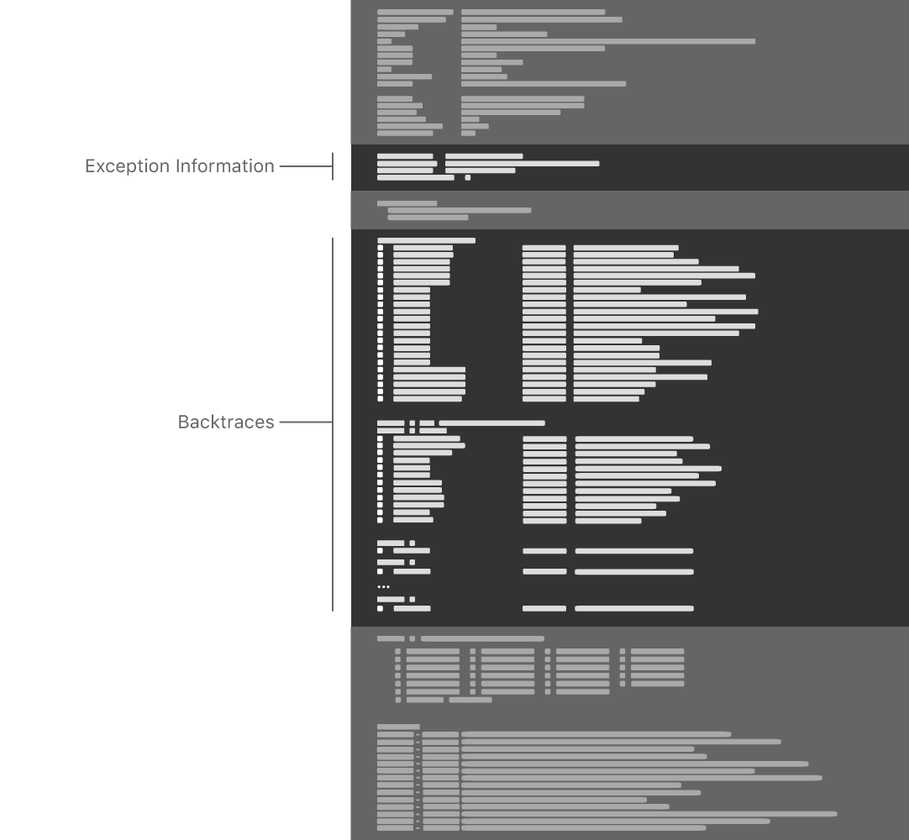

# 确定常见崩溃的原因

[Identifying the Cause of Common Crashes](https://developer.apple.com/documentation/xcode/diagnosing_issues_using_crash_reports_and_device_logs/identifying_the_cause_of_common_crashes)

在崩溃报告中查找可识别常见问题的模式，然后根据该模式调查问题。

---

## 总览

您可以通过在崩溃报告中查找特定的模式并根据该模式显示的内容采取特定的诊断措施来确定许多应用程序崩溃的原因。要识别模式，请查阅每个崩溃报告中可用的两个部分：

- “异常信息”部分中的异常代码标识了应用程序崩溃的具体方式。
- 回溯显示崩溃时线程正在执行什么代码。





某些常见的崩溃类型具有“诊断消息”部分或`Last Exception Backtrace`“回溯”部分中的，以进一步描述问题。并非所有崩溃报告中都包含这些部分。[检查崩溃报告](https://developer.apple.com/documentation/xcode/diagnosing_issues_using_crash_reports_and_device_logs/examining_the_fields_in_a_crash_report)中的字段将详细描述每个部分和字段。

将本文提供的示例与要调查的崩溃报告进行比较。找到匹配项后，请转至有关该类型崩溃的更详细的文章。

确定故障报告是否包含常见问题的模式是诊断问题的第一步。在某些情况下，建议的诊断操作无法识别问题的原因，需要对整个崩溃报告进行更彻底的分析。[分析崩溃报告](https://developer.apple.com/documentation/xcode/diagnosing_issues_using_crash_reports_and_device_logs/analyzing_a_crash_report)描述了如何对[崩溃报告](https://developer.apple.com/documentation/xcode/diagnosing_issues_using_crash_reports_and_device_logs/analyzing_a_crash_report)进行详细分析。

> **重要**
> 在查找特定模式之前，请确认您具有操作系统生成的完全符号化的崩溃报告。请参阅[确定故障报告是否为符号](https://developer.apple.com/documentation/xcode/diagnosing_issues_using_crash_reports_and_device_logs/adding_identifiable_symbol_names_to_a_crash_report#3403796)。

### 确定崩溃是否是Swift Runtime错误

Swift使用内存安全技术来及早发现编程错误。如果Swift运行时遇到编程错误，则运行时会捕获该错误并有意使应用程序崩溃。这些崩溃在崩溃报告中具有可识别的模式。在ARM处理器（包括iOS，iPadOS，watchOS和tvOS设备）上，崩溃报告中的异常信息如下所示：

```
Exception Type:  EXC_BREAKPOINT (SIGTRAP)
...
Termination Signal: Trace/BPT trap: 5
Termination Reason: Namespace SIGNAL, Code 0x5
```

在Intel处理器（包括适用于macOS，Mac Catalyst的应用程序以及适用于iOS，watchOS和tvOS的模拟器）上，崩溃报告中的异常信息如下所示：

```
Exception Type:        EXC_BAD_INSTRUCTION (SIGILL)
...
Exception Note:        EXC_CORPSE_NOTIFY

Termination Signal:    Illegal instruction: 4
Termination Reason:    Namespace SIGNAL, Code 0x4
```

此外，崩溃报告还会显示遇到该错误的线程，回溯中的帧0标识应用程序中包含该错误的特定代码行，例如：

```
Thread 0 Crashed:
0   MyCoolApp                         0x0000000100a71a88 @objc ViewController.viewDidLoad() (in MyCoolApp) (ViewController.swift:18)
```

[解决因Swift运行时错误而引起的崩溃，](https://developer.apple.com/documentation/xcode/diagnosing_issues_using_crash_reports_and_device_logs/identifying_the_cause_of_common_crashes/addressing_crashes_from_swift_runtime_errors)介绍了如何解决此类崩溃。

### 寻找语言异常的迹象

Apple的系统框架在运行时遇到某些类型的编程错误时（例如，访问索引超出范围的数组）会抛出语言异常。要确定崩溃是否是由于语言异常引起的，请首先确认崩溃报告包含以下模式：

```
Exception Type:  EXC_CRASH (SIGABRT)
Exception Codes: 0x0000000000000000, 0x0000000000000000
Exception Note:  EXC_CORPSE_NOTIFY
```

由于语言异常而导致`Last Exception Backtrace`的崩溃在崩溃报告中也有：

```
Last Exception Backtrace:
0   CoreFoundation                    0x19aae2a48 __exceptionPreprocess + 220
1   libobjc.A.dylib                   0x19a809fa4 objc_exception_throw + 55
```

如果您的崩溃报告包含这些模式，请参阅“[解决语言异常崩溃”](https://developer.apple.com/documentation/xcode/diagnosing_issues_using_crash_reports_and_device_logs/identifying_the_cause_of_common_crashes/addressing_language_exception_crashes)以了解如何解决崩溃。

### 检查看门狗信息

操作系统使用看门狗来监视应用程序响应。如果某个应用程序无响应，则看门狗会终止该应用程序，并使用`0x8badf00d`“终止原因”中的代码创建一个崩溃报告：

```
Exception Type:  EXC_CRASH (SIGKILL)
Exception Codes: 0x0000000000000000, 0x0000000000000000
Exception Note:  EXC_CORPSE_NOTIFY
Termination Reason: Namespace SPRINGBOARD, Code 0x8badf00d
```

在无响应的应用程序的崩溃报告中，`Termination Description`包含来自看门狗的有关应用程序如何花费时间的信息。例如：

```
Termination Description: SPRINGBOARD, 
    scene-create watchdog transgression: application<com.example.MyCoolApp>:667
    exhausted real (wall clock) time allowance of 19.97 seconds 
    | ProcessVisibility: Foreground 
    | ProcessState: Running 
    | WatchdogEvent: scene-create 
    | WatchdogVisibility: Foreground 
    | WatchdogCPUStatistics: ( 
    |  "Elapsed total CPU time (seconds): 15.290 (user 15.290, system 0.000), 28% CPU", 
    |  "Elapsed application CPU time (seconds): 0.367, 1% CPU" 
    | )
```

> **注意**
> 为了提高可读性，此示例中有额外的换行符。在此示例的原始崩溃报告文件中，看门狗信息较少。

请参阅[解决看门狗终止问题](https://developer.apple.com/documentation/xcode/diagnosing_issues_using_crash_reports_and_device_logs/identifying_the_cause_of_common_crashes/addressing_watchdog_terminations)以诊断您的应用无响应的原因。

### 确定崩溃报告是否包含僵尸迹象

*僵尸对象*是由Objective-C运行时发出的消息，它们从内存中重新分配后就不再存在。消息传送的解除分配的对象可导致崩溃，或在Objective-C运行的功能，如本实施例中与：[`objc_msgSend`](https://developer.apple.com/documentation/objectivec/1456712-objc_msgsend)`objc_retain``objc_release``objc_msgSend`

```
Thread 0 Crashed:
0   libobjc.A.dylib                   0x00000001a186d190 objc_msgSend + 16
1   Foundation                        0x00000001a1f31238 __NSThreadPerformPerform + 232
2   CoreFoundation                    0x00000001a1ac67e0 __CFRUNLOOP_IS_CALLING_OUT_TO_A_SOURCE0_PERFORM_FUNCTION__ + 24
```

另一种指示僵尸对象的模式是存在`Last Exception Backtrace`带有堆栈框的方法的僵尸对象：[`doesNotRecognizeSelector(_:)`](https://developer.apple.com/documentation/objectivec/nsobject/1418637-doesnotrecognizeselector)

```
Last Exception Backtrace:
0   CoreFoundation                    0x1bf596a48 __exceptionPreprocess + 220
1   libobjc.A.dylib                   0x1bf2bdfa4 objc_exception_throw + 55
2   CoreFoundation                    0x1bf49a5a8 -[NSObject+ 193960 (NSObject) doesNotRecognizeSelector:] + 139
```

如果崩溃报告显示您的应用程序包含僵尸，请参阅[调查僵尸对象崩溃](https://developer.apple.com/documentation/xcode/diagnosing_issues_using_crash_reports_and_device_logs/identifying_the_cause_of_common_crashes/investigating_crashes_for_zombie_objects)。

### 确定是否存在内存访问问题

当您的应用意外使用内存时，您将收到有关内存访问问题的崩溃报告。这些类型的崩溃报告具有异常类型，以及该字段中的其他信息。例如：`EXC_BAD_ACCESS``VM Region Info`

```
Exception Type:  EXC_BAD_ACCESS (SIGSEGV)
Exception Subtype: KERN_INVALID_ADDRESS at 0x0000000000000000
VM Region Info: 0 is not in any region.  Bytes before following region: 4307009536
      REGION TYPE                      START - END             [ VSIZE] PRT/MAX SHRMOD  REGION DETAIL
      UNUSED SPACE AT START
--->  
      __TEXT                 0000000100b7c000-0000000100b84000 [   32K] r-x/r-x SM=COW  ...pp/MyGreatApp
```

[调查内存访问崩溃](https://developer.apple.com/documentation/xcode/diagnosing_issues_using_crash_reports_and_device_logs/identifying_the_cause_of_common_crashes/investigating_memory_access_crashes)包含有关不同类型的内存访问问题以及如何进行调查的信息。

### 确定框架是否缺失

如果某个应用程序因缺少必需的框架而崩溃，则崩溃报告将包含异常代码。您还可以在崩溃报告中找到一个，标识动态链接程序找不到的特定框架。这是一个示例，其中包含额外的换行符以提高可读性：`EXC_CRASH (SIGABRT)``Termination Description``dyld`

```
Exception Type: EXC_CRASH (SIGABRT)
Exception Codes: 0x0000000000000000, 0x0000000000000000
Exception Note: EXC_CORPSE_NOTIFY
Termination Description: DYLD, dependent dylib '@rpath/MyFramework.framework/MyFramework' 
    not found for '<path>/MyCoolApp.app/MyCoolApp', tried but didn't find: 
    '/usr/lib/swift/MyFramework.framework/MyFramework' 
    '<path>/MyCoolApp.app/Frameworks/MyFramework.framework/MyFramework' 
    '@rpath/MyFramework.framework/MyFramework' 
    '/System/Library/Frameworks/MyFramework.framework/MyFramework'
```

> **重要**
> 此消息的确切内容取决于特定的操作系统和操作系统版本。在所有情况下，该消息均清楚表明未找到预期的框架。

[解决丢失的框架崩溃](https://developer.apple.com/documentation/xcode/diagnosing_issues_using_crash_reports_and_device_logs/identifying_the_cause_of_common_crashes/addressing_missing_framework_crashes)讨论了如何解决此问题。