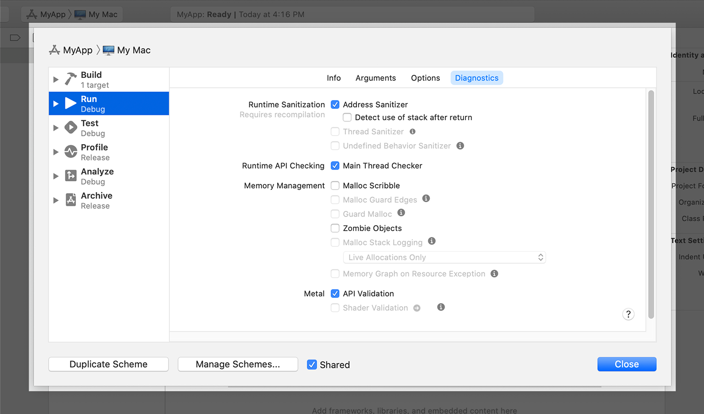
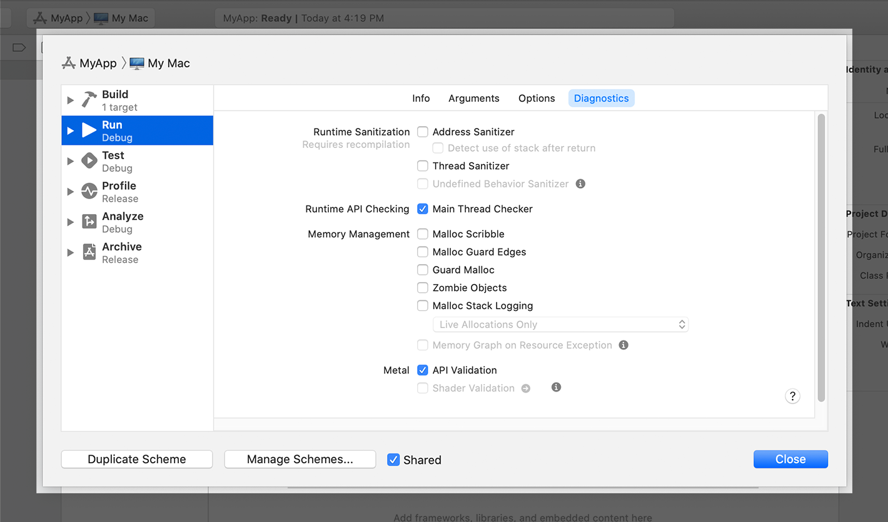
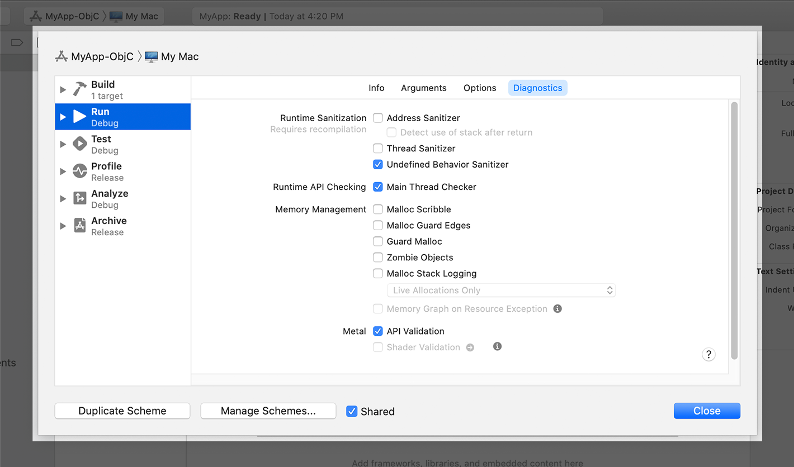

# 尽早诊断内存，线程和崩溃问题

[Diagnosing Memory, Thread, and Crash Issues Early](https://developer.apple.com/documentation/xcode/diagnosing_memory_thread_and_crash_issues_early)

使用Xcode的清理工具在测试过程中识别应用程序中的运行时崩溃和未定义的行为。

---

## 总览

在开发过程中发现潜在问题可以节省以后的测试时间并提高代码的稳定性。Xcode提供了几种运行时工具来识别代码中的潜在问题：

- Address Sanitizer-ASan工具可识别与内存相关的潜在损坏问题。
- 线程清理程序-TSan工具检测线程之间的竞争状况。
- 主线程检查器-此工具验证必须在主线程上运行的系统API是否确实在该线程上运行。
- 未定义的行为清理器-UBSan工具检测被零除的错误，尝试使用未对齐的指针访问内存以及其他未定义的行为。

这些是基于LLVM的工具，可对代码添加特定的检查。您可以在构建时使用Xcode方案编辑器启用它们。选择适合您项目的方案，然后选择“产品”>“方案”>“编辑方案”以显示方案编辑器。选择运行或测试方案，导航到“诊断”部分，然后选择要运行的消毒剂。

> **注意**
> 清理工具支持所有基于C的语言。这些工具还支持Swift语言，但Undefined Behavior Sanitizer工具除外，该工具仅支持基于C的语言。

使用消毒剂工具只是捕获某些类型问题的一种方法。始终使用一组全面的单元测试来测试代码，并使用其他集成和UI测试来在运行时练习代码。有关测试代码的更多信息，请参见[在Xcode中测试您的应用程序](https://developer.apple.com/documentation/xcode/testing_your_apps_in_xcode)。

### 在您的代码中找到内存损坏问题

不正确地访问内存可能将意外的问题引入代码中，甚至构成安全威胁。Address Sanitizer工具检测不属于已分配块的内存访问尝试。要启用此工具，请从相应方案的“诊断”部分中选择“地址清理器”。



要从命令行启用ASan，请使用以下标志：

- `-fsanitize=address` （铛）
- `-sanitize=address` （swiftc）
- `-enableAddressSanitizer YES` （xcodebuild）

Address Sanitizer工具用自定义实现替换了`malloc(_:)`和`free(_:)`功能。自定义`malloc(_:)`函数将请求的内存块包含在特殊的禁区周围，并报告访问这些区域的尝试。该`free(_:)`功能将释放的块放入特殊的隔离队列中，并报告尝试访问该隔离内存的尝试。

> **重要**
> Address Sanitizer无法检测到内存泄漏，尝试访问未初始化的内存或整数溢出错误。使用仪器和其他消毒剂工具查找其他错误。

对于大多数用例，Address Sanitizer添加到您的代码中的开销对于日常开发应该是可以接受的。使用Address Sanitizer运行代码将内存使用量增加2到3倍，并且代码的速度降低2到5倍。为了提高代码的内存使用率，请通过`-O1`优化来编译代码。

### 检测应用程序线程之间的数据争用

当多个线程在没有适当同步的情况下访问同一内存时，就会发生争用情况。在常规测试中很难检测到竞争状况，因为它们不会持续发生。但是，修复它们很重要，因为它们会使您的代码行为异常，甚至可能导致内存损坏。

若要检测竞争状况和其他与线程相关的问题，请从适当的构建方案的“诊断”部分启用“线程清理程序”工具。


要从命令行启用TSan，请使用以下标志：

- `-fsanitize=thread` （铛）
- `-santize=thread` （swiftc）
- `-enableThreadSanitizer YES` （xcodebuild）

线程清理工具将诊断信息插入代码中，以记录每次内存读取或写入操作。这些诊断信息会为每个操作生成一个时间戳，以及它在内存中的位置。然后，该工具报告大约在同一时间在同一位置发生的所有操作。该工具还可以检测其他与线程相关的错误，例如未初始化的互斥锁和线程泄漏。

> **重要**
> 您不能使用Thread Sanitizer来诊断watchOS应用程序或诊断设备上运行的iOS和tvOS应用程序。仅在64位macOS应用上使用Thread Sanitizer，或者诊断在Simulator中运行的64位iOS或tvOS应用。

由于Thread Sanitizer将诊断插入代码中，因此将内存使用量增加了五到十倍。使用这些诊断程序运行代码还会导致应用程序速度降低2到20倍。为了提高代码的内存使用率，请通过`-O1`优化来编译代码。

### 在后台线程上检测不正确的UI更新

某些系统框架包含API，您只能从应用程序的主线程中调用。此要求适用于大多数AppKit和UIKit用户界面API，也适用于某些其他系统API。从主线程调用这些API可以通过序列化关联任务的执行来防止竞争情况。无法在主线程上执行这些操作可能会导致视觉缺陷，数据损坏或崩溃。

主线程检查器工具可确保必须在主线程上进行的所有调用都执行此操作。要启用此工具，请从相应方案的“诊断”部分中选择“主线程检查器”。



Main Thread Checker工具动态地将必须在主线程上执行的系统方法替换为检查当前线程的变体。该工具仅替换具有众所周知的线程要求的系统API，并且不会替换所有系统API。由于替换发生在系统框架中，因此Main Thread Checker不需要您重新编译应用程序。

> **注意**
> 由于Main Thread Checker不需要您重新编译代码，因此可以在现有的macOS二进制文件上运行它。将位于的动态库注入可执行文件。`/Applications/Xcode.app/Contents/Developer/usr/lib/libMainThreadChecker.dylib`

要解决由主线程检查器识别的问题，请将调用分派到应用程序的主线程。发生主线程错误的最常见位置是完成处理程序块。以下代码通过对主线程的异步调度调用包装了文本标签修改。

```
let task = URLSession.shared.dataTask(with: url) { (data, response, error) in
   if let data = data {
      // Redirect to the main thread.
      DispatchQueue.main.async {
         self.label.text = "\(data.count) bytes downloaded"
      }
   }
}
task.resume()
```

主线程检查器对性能的影响很小。该工具为您的进程增加了1-2％的CPU开销，并使进程启动时间增加了不超过100毫秒。由于这种影响很小，因此Xcode默认为与开发相关的方案启用Main Thread Checker。

### 使用不确定的语义检测操作

导致未定义行为的代码可能导致崩溃或错误输出。在某些情况下，该代码最初可能根本不会导致任何问题，这使得在条件不同时，以后甚至更难以诊断问题。Undefined Behavior Sanitizer工具检查基于C的代码是否存在各种常见的运行时错误，包括：

- 尝试被零除
- 尝试从未对齐的指针加载内存
- 尝试取消引用`NULL`指针
- 数学运算导致整数溢出

要启用此工具，请从相应方案的“诊断”部分中选择“未定义的行为清除程序”。



要从命令行启用UBSan，请`-fsanitize=undefined`在clang中添加选项或在xcodebuild中添加选项。要启用单个消毒剂检查，请使用以下选项：`enableUndefinedBehaviorSanitizer YES`

| UBSan检查                                                    | 编译器标志                                                   |
| :----------------------------------------------------------- | :----------------------------------------------------------- |
| [指针未对齐](https://developer.apple.com/documentation/xcode/diagnosing_memory_thread_and_crash_issues_early/misaligned_pointer) | `-fsanitize=alignment`                                       |
| [无效的布尔值](https://developer.apple.com/documentation/xcode/diagnosing_memory_thread_and_crash_issues_early/invalid_boolean) | `-fsanitize=bool`                                            |
| [越界数组访问](https://developer.apple.com/documentation/xcode/diagnosing_memory_thread_and_crash_issues_early/out-of-bounds_array_access) | `-fsanitize=bounds`                                          |
| [无效的枚举值](https://developer.apple.com/documentation/xcode/diagnosing_memory_thread_and_crash_issues_early/invalid_enumeration_value) | `-fsanitize=enum`                                            |
| [动态类型违规](https://developer.apple.com/documentation/xcode/diagnosing_memory_thread_and_crash_issues_early/dynamic_type_violation) | `-fsanitize=vptr`                                            |
| [无效的浮动演员表](https://developer.apple.com/documentation/xcode/diagnosing_memory_thread_and_crash_issues_early/invalid_float_cast) | `-fsanitize=float-cast-overflow`                             |
| [被零除](https://developer.apple.com/documentation/xcode/diagnosing_memory_thread_and_crash_issues_early/division_by_zero) | `-fsanitize=integer-divide-by-zero``-fsanitize=float-divide-by-zero` |
| [非空参数违反](https://developer.apple.com/documentation/xcode/diagnosing_memory_thread_and_crash_issues_early/nonnull_argument_violation) | `-fsanitize=nonnull-attribute``-fsanitize=nullability-arg`   |
| [非空返回值违反](https://developer.apple.com/documentation/xcode/diagnosing_memory_thread_and_crash_issues_early/nonnull_return_value_violation) | `-fsanitize=returns-nonnull-attribute``-fsanitize-nullability-return` |
| [非空变量分配违规](https://developer.apple.com/documentation/xcode/diagnosing_memory_thread_and_crash_issues_early/nonnull_variable_assignment_violation) | `-fsanitize=nullability-assign`                              |
| [空引用创建和空指针取消引用](https://developer.apple.com/documentation/xcode/diagnosing_memory_thread_and_crash_issues_early/null_reference_creation_and_null_pointer_dereference) | `-fsanitize=null`                                            |
| [无效的物件大小](https://developer.apple.com/documentation/xcode/diagnosing_memory_thread_and_crash_issues_early/invalid_object_size) | `-fsanitize=object-size`                                     |
| [无效班次](https://developer.apple.com/documentation/xcode/diagnosing_memory_thread_and_crash_issues_early/invalid_shift) | `-fsanitize=shift`                                           |
| [整数溢出](https://developer.apple.com/documentation/xcode/diagnosing_memory_thread_and_crash_issues_early/integer_overflow) | `-fsanitize=signed-integer-overflow`                         |
| [到达不可达点](https://developer.apple.com/documentation/xcode/diagnosing_memory_thread_and_crash_issues_early/reaching_of_unreachable_point) | `-fsanitize=unreachable`                                     |
| [无效的可变长度数组](https://developer.apple.com/documentation/xcode/diagnosing_memory_thread_and_crash_issues_early/invalid_variable-length_array) | `-fsanitize=vla-bound`                                       |

Undefined Behavior Sanitizer工具会在编译时将诊断信息插入代码中。这些检查的性质因操作类型而异。例如，在对整数值执行数学运算之前，该工具会添加检查以确定该运算是否触发整数溢出。

Undefined Behavior Sanitizer对性能的影响很小。该工具将平均20％的CPU开销添加到应用的调试版本中。