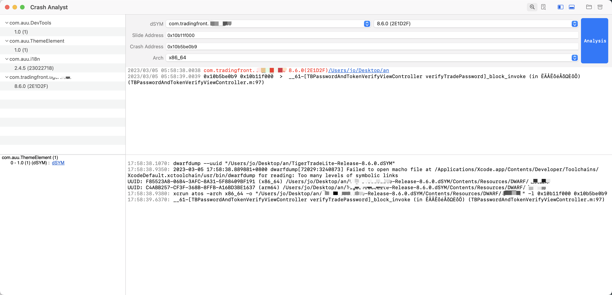

# 崩溃解析辅助工具


## 1. 页面说明



1. 状态栏右侧可以切换分析崩溃信息的方式，有以下几种：
    - 直接分析崩溃日志文件
    - 按崩溃内存地址自己按条的去解析崩溃信息
2. 左侧是崩溃信息辅助页面，上部分是dSYM文件列表，下部分是选中dSYM后的概要信息
4. 右下方是日志输出页面，所有操作的记录都可以输入到这里

## 2. 崩溃文件解析

**使用说明**

1. 将[崩溃日志原始文件](./res/diagnostic_crash_file.md) copy到当前输入框内
2. 选择`Analysis`，如果存在有效的dSYM文件，会在右边显示出对应的文件地址，如果没有，则会有选择文件的弹窗弹出，提示用户去选择dSYM文件或者归档文件
5. 然后系统会自动的解析崩溃日志文件内容

**示例**
自动解析后会在需要解析的内存地址后拼上解析后的内容。

## 3. 崩溃内存地址解析

给使用者提供自己主动解析崩溃内存地址的工具。

```
    Thread 0 name:  Dispatch queue: apple.main-thread
    Thread 0 Crashed:
    0   libsystem_kernel.dylib          0x3618da1c 0x3617c000 + 72220 (__pthread_kill + 8)
    1   libsystem_c.dylib               0x3625cbf8 0x36231000 + 179192 (abort + 72)
    2   Crash-Tester                    0x000668a8 0x5f000 + 30888
    3   Crash-Tester                    0x00065628 0x5f000 + 26152
    4   Crash-Tester                    0x00065d50 0x5f000 + 27984
    5   Crash-Tester                    0x00066400 0x5f000 + 29696
    6   UIKit                           0x31634518 0x315e0000 + 345368 (-[UITableView _selectRowAtIndexPath:animated:scrollPosition:notifyDelegate:] + 660)
    7   UIKit                           0x316980e8 0x315e0000 + 753896 (-[UITableView _userSelectRowAtPendingSelectionIndexPath:] + 128)
    8   Foundation                      0x34e366d0 0x34db1000 + 546512 (__NSFireDelayedPerform + 364)
    9   CoreFoundation                  0x31555a40 0x314e0000 + 481856 (__CFRUNLOOP_IS_CALLING_OUT_TO_A_TIMER_CALLBACK_FUNCTION__ + 8)
    10  CoreFoundation                  0x31557ec8 0x314e0000 + 491208 (__CFRunLoopDoTimer + 848)
    11  CoreFoundation                  0x31558840 0x314e0000 + 493632 (__CFRunLoopRun + 1084)
    12  CoreFoundation                  0x314e8ec0 0x314e0000 + 36544 (CFRunLoopRunSpecific + 228)
    13  CoreFoundation                  0x314e8dc8 0x314e0000 + 36296 (CFRunLoopRunInMode + 56)
    14  GraphicsServices                0x30e67418 0x30e63000 + 17432 (GSEventRunModal + 108)
    15  GraphicsServices                0x30e674c8 0x30e63000 + 17608 (GSEventRun + 60)
    16  UIKit                           0x3160ed68 0x315e0000 + 191848 (-[UIApplication _run] + 404)
    17  UIKit                           0x3160c800 0x315e0000 + 182272 (UIApplicationMain + 664)
    18  Crash-Tester                    0x000607b8 0x5f000 + 6072 <font style="color:#ff0000">main + 164</font>
```

如上的崩溃信息中，在崩溃线程的第`2`、`3`、`4`、`5`行的调用即为当前项目的崩溃，可以看到在其他行的调用中，内存地址右侧有项目中对应的代码信息，当时这几行没有，这就是需要解析的内存地址，如：
```
2   Crash-Tester                    0x000668a8 0x5f000 + 30888
```
其中`0x5f000`为偏移地址，`0x000668a8`崩溃地址。
找到需要的信息填入各输入框，然后选择对应的dSYM文件，再点击右侧的解析按钮即可。


## 4. 相关信息

### 1）归档文件地址

每次打包后都会在本地生成一个归档文件，所有归档文件都在 `/Library/Developer/Xcode/Archives/` 目录下，而`dSYM`文件则在归档文件中的`dSYM`目录下。

### 2）解析dSYM文件对应的uuid和架构

```
调用指令：dwarfdump --uuid {{dsym 文件地址}}
解析结果：UUID: EE396B01-3C64-33E6-BFD1-26C2C41C0ED2 (x86_64) {{DWARF 文件地址}}
```
对解析结果使用正则解析：`UUID:\s+([\w-]+)\s+\((\w+)\)\s+(.+)$`
- 分组1：uuid
- 分组2：架构类型
- 分组3：DWARF文件地址

### 3）解析崩溃内存地址对应的代码

```
调用指令：xcrun atos -arch {{arch}} -o \"{{dwarfFile}}\" -l {{slideAddress}} {{crashAddress}}
```
如果信息成功选择，执行后即可得到解析后的内容。
